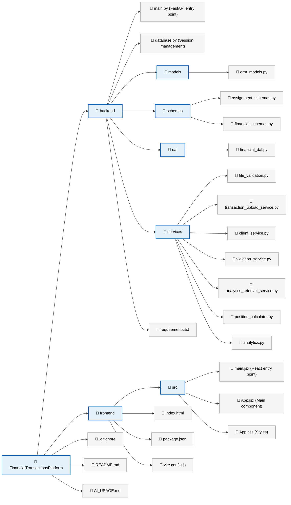

# Financial Transactions Platform

A full-stack financial transactions management application built with modern web technologies.

## Project Structure



## Prerequisites

- Python 3.8+ with pip
- Node.js 16+ with npm
- Git

## Backend Setup

### 1. Navigate to the backend directory

```bash
cd backend
```

### 2. Create and activate a virtual environment

**Windows:**
```bash
python -m venv venv
venv\Scripts\activate
```

**macOS/Linux:**
```bash
python3 -m venv venv
source venv/bin/activate
```

### 3. Install dependencies

```bash
pip install -r requirements.txt
```

### 4. Run the backend server

```bash
python main.py
```

The backend will start at `http://localhost:8000`

### 5. Access API documentation

Once running, visit `http://localhost:8000/docs` for interactive Swagger UI documentation.

## Frontend Setup

### 1. Navigate to the frontend directory

```bash
cd frontend
```

### 2. Install dependencies

```bash
npm install
```

### 3. Run the development server

```bash
npm run dev
```

The frontend will start at `http://localhost:5173`

### 4. Build for production

```bash
npm run build
```

## Running Both Services

To run both the backend and frontend simultaneously:

**Terminal 1 - Backend:**
```bash
cd backend
python -m venv venv
# Activate virtual environment (see above)
pip install -r requirements.txt
python main.py
```

**Terminal 2 - Frontend:**
```bash
cd frontend
npm install
npm run dev
```

## Architecture Overview

The Financial Transactions Platform follows a **strict 4-layer architecture** for clean separation of concerns:

### 1. **API Layer** (`main.py`)
- Clean, thin endpoint handlers (~5-10 lines each)
- All HTTP requests/responses handled here
- Delegates business logic to Service Layer
- No direct database queries

### 2. **Service Layer** (`services/`)
- Contains all business logic (FIFO calculations, validations, analytics)
- Database-agnostic (receives data, processes, returns results)
- Examples:
  - `file_validation.py` - File type & schema validation
  - `transaction_upload_service.py` - Transaction processing & row validation
  - `client_service.py` - Client retrieval & position calculations
  - `violation_service.py` - Violation retrieval
  - `analytics_retrieval_service.py` - Analytics aggregation
  - `position_calculator.py` - FIFO position calculations
  - `analytics.py` - Metrics generation

### 3. **Data Access Layer** (`dal/financial_dal.py`)
- All database queries encapsulated in DAL classes
- No business logic, purely database operations
- Classes: `ClientDAL`, `TransactionDAL`, `ViolationDAL`

### 4. **Models & Schemas** (`models/`, `schemas/`)
- **ORM Models** (`models/orm_models.py`) - SQLAlchemy 2.0 mapped classes
- **Pydantic Schemas** (`schemas/`) - HTTP request/response validation
  - `assignment_schemas.py` - Response schemas for 5 endpoints
  - `financial_schemas.py` - Shared input/output schemas

### Key Principles (SOLID)
✅ **Single Responsibility** - Each file/class has one job  
✅ **Open/Closed** - Easy to extend without modifying existing code  
✅ **Dependency Inversion** - Services depend on abstractions (DALs)  
✅ **Clean Dependencies** - One-directional: API → Service → DAL → Models

- ✅ FastAPI backend with automatic API documentation
- ✅ SQLite database with SQLAlchemy ORM
- ✅ React frontend with Vite for fast development
- ✅ CORS configured for local development
- ✅ Health check endpoint
- ✅ Example fetch request from frontend to backend

## Technology Stack

### Backend
- **Framework:** FastAPI
- **Server:** Uvicorn
- **Database:** SQLite with SQLAlchemy ORM
- **Testing:** pytest
- **Data Processing:** pandas, openpyxl

### Frontend
- **Framework:** React 18
- **Build Tool:** Vite
- **HTTP Client:** Axios
- **Styling:** CSS3

## Next Steps

1. **Test Current Implementation:**
   - Run the backend and test all 5 endpoints via Swagger UI
   - Upload sample transaction data to `/upload-transactions`
   - Verify FIFO position calculations in `/clients/{client_id}/positions`

2. **Add New Features Using Service Pattern:**
   - Create new service file in `backend/services/{feature_name}.py`
   - Create corresponding DAL methods in `backend/dal/financial_dal.py`
   - Create request/response schemas in `backend/schemas/`
   - Add lean endpoint in `main.py` that delegates to your service

3. **Documentation:**
   - Create architecture doc: `docs/architecture/{feature_name}/README.md`
   - Use template: `docs/architecture/__templates/feature_architecture.md`

4. **Frontend Integration:**
   - Build React components to consume the API endpoints
   - Use Axios to call backend services

5. **Add Authentication:**
   - Implement user authentication and authorization
   - Add JWT token validation to endpoints

## API Endpoints

All 5 endpoints follow the clean architecture pattern - thin HTTP handlers that delegate to services:

- `POST /upload-transactions` - Bulk upload transactions (delegates to `TransactionUploadService`)
- `GET /clients` - List all clients (delegates to `ClientRetrievalService`)
- `GET /clients/{client_id}/positions` - Calculate positions using FIFO (delegates to `ClientPositionService`)
- `GET /violations` - Retrieve business rule violations (delegates to `ViolationRetrievalService`)
- `GET /analytics` - Get aggregated analytics (delegates to `AnalyticsRetrievalService`)

### Testing the Endpoints

1. **Start Backend:**
   ```bash
   cd backend
   python main.py
   ```

2. **Open Swagger UI:**
   Navigate to `http://localhost:8000/docs`

3. **Example Flow:**
   - Upload transactions via `/upload-transactions` with a CSV/Excel file
   - Retrieve clients via `/clients`
   - Get positions for a client via `/clients/{client_id}/positions`
   - Check violations via `/violations`
   - View analytics via `/analytics`

## Environment Variables

Create a `.env` file in the backend directory if needed:

```
DATABASE_URL=sqlite:///./transactions.db
DEBUG=True
```

## Troubleshooting

### Backend won't start
- Ensure Python 3.8+ is installed
- Check that port 8000 is available
- Verify all dependencies are installed: `pip install -r requirements.txt`

### Frontend shows connection error
- Ensure backend is running on `http://localhost:8000`
- Check CORS settings in `main.py`
- Verify browser console for detailed errors

### Database issues
- Delete `transactions.db` to reset the database
- Ensure write permissions in the backend directory

## Contributing

Please read our guidelines in `AI_USAGE.md` before contributing.

## License

This project is open source and available under the MIT License.

## Support

For issues, questions, or suggestions, please open an issue in the project repository.