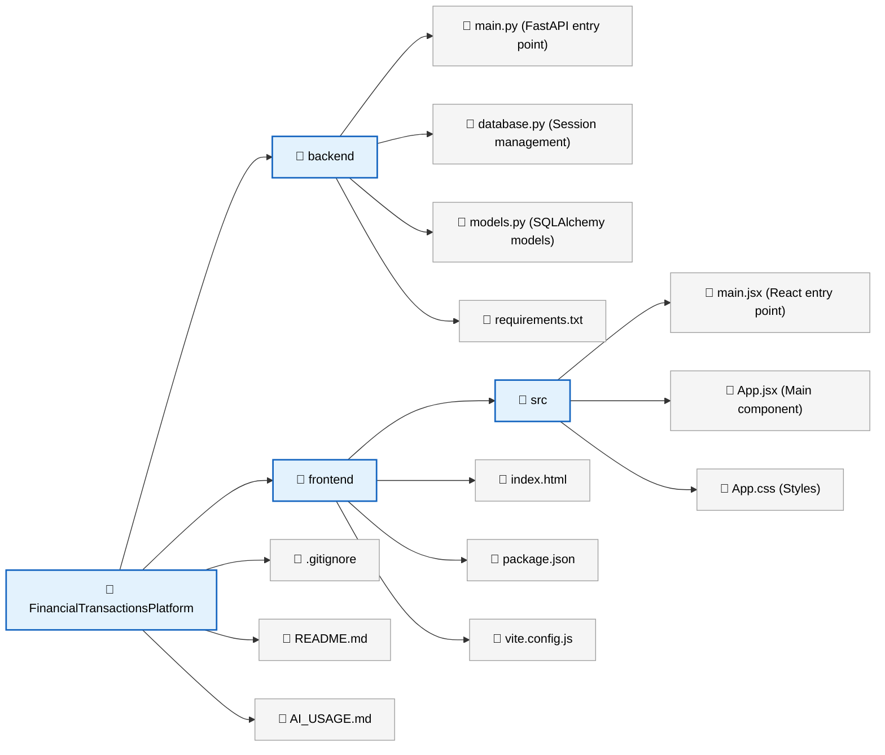

# Financial Transactions Platform

A full-stack financial transactions management application built with modern web technologies.

## Project Structure



## Prerequisites

- Python 3.8+ with pip
- Node.js 16+ with npm
- Git

## Backend Setup

### 1. Navigate to the backend directory

```bash
cd backend
```

### 2. Create and activate a virtual environment

**Windows:**
```bash
python -m venv venv
venv\Scripts\activate
```

**macOS/Linux:**
```bash
python3 -m venv venv
source venv/bin/activate
```

### 3. Install dependencies

```bash
pip install -r requirements.txt
```

### 4. Run the backend server

```bash
python main.py
```

The backend will start at `http://localhost:8000`

### 5. Access API documentation

Once running, visit `http://localhost:8000/docs` for interactive Swagger UI documentation.

## Frontend Setup

### 1. Navigate to the frontend directory

```bash
cd frontend
```

### 2. Install dependencies

```bash
npm install
```

### 3. Run the development server

```bash
npm run dev
```

The frontend will start at `http://localhost:5173`

### 4. Build for production

```bash
npm run build
```

## Running Both Services

To run both the backend and frontend simultaneously:

**Terminal 1 - Backend:**
```bash
cd backend
python -m venv venv
# Activate virtual environment (see above)
pip install -r requirements.txt
python main.py
```

**Terminal 2 - Frontend:**
```bash
cd frontend
npm install
npm run dev
```

## Features

- ✅ FastAPI backend with automatic API documentation
- ✅ SQLite database with SQLAlchemy ORM
- ✅ React frontend with Vite for fast development
- ✅ CORS configured for local development
- ✅ Health check endpoint
- ✅ Example fetch request from frontend to backend

## Technology Stack

### Backend
- **Framework:** FastAPI
- **Server:** Uvicorn
- **Database:** SQLite with SQLAlchemy ORM
- **Testing:** pytest
- **Data Processing:** pandas, openpyxl

### Frontend
- **Framework:** React 18
- **Build Tool:** Vite
- **HTTP Client:** Axios
- **Styling:** CSS3

## Next Steps

1. **Design Database Schema:** Update `models.py` with your transaction entities
2. **Create API Endpoints:** Add transaction CRUD operations to `main.py`
3. **Build UI Components:** Expand the React frontend with transaction management components
4. **Add Authentication:** Implement user authentication and authorization
5. **Write Tests:** Add unit and integration tests

## API Endpoints (Initial)

- `GET /` - Welcome message
- `GET /health` - Health check status
- `GET /docs` - Swagger UI documentation (after backend starts)

## Environment Variables

Create a `.env` file in the backend directory if needed:

```
DATABASE_URL=sqlite:///./transactions.db
DEBUG=True
```

## Troubleshooting

### Backend won't start
- Ensure Python 3.8+ is installed
- Check that port 8000 is available
- Verify all dependencies are installed: `pip install -r requirements.txt`

### Frontend shows connection error
- Ensure backend is running on `http://localhost:8000`
- Check CORS settings in `main.py`
- Verify browser console for detailed errors

### Database issues
- Delete `transactions.db` to reset the database
- Ensure write permissions in the backend directory

## Contributing

Please read our guidelines in `AI_USAGE.md` before contributing.

## License

This project is open source and available under the MIT License.

## Support

For issues, questions, or suggestions, please open an issue in the project repository.