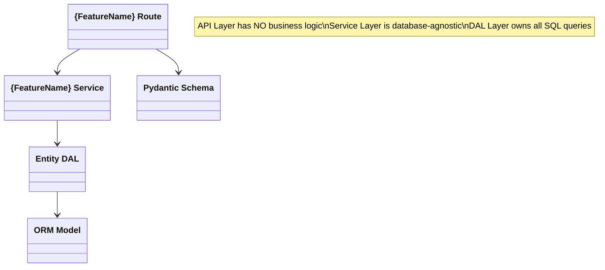
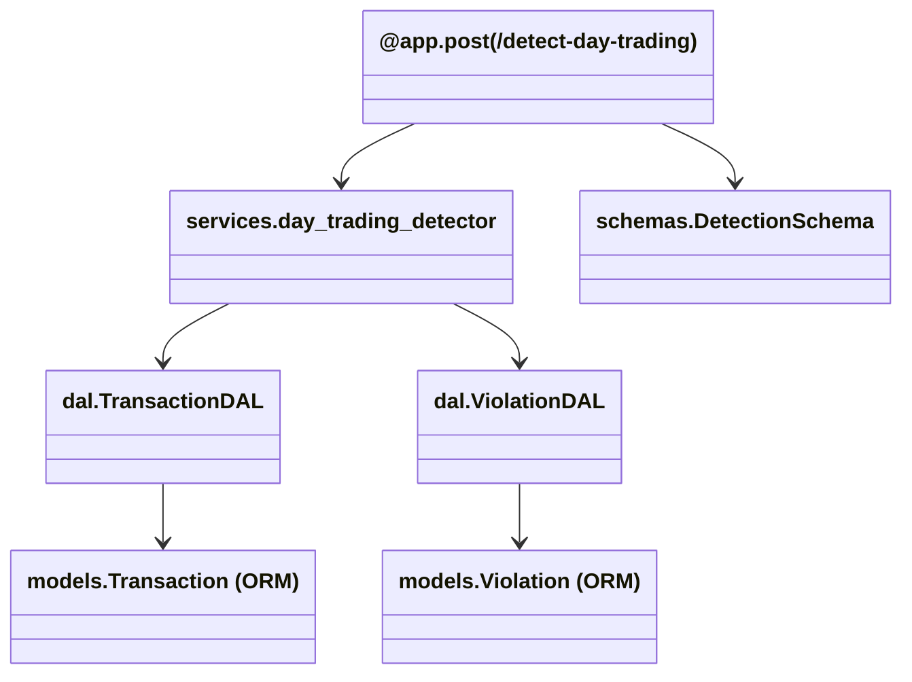

# Feature Architecture Template

**COPY THIS FILE AND CUSTOMIZE FOR EACH NEW FEATURE**

Replace `{FeatureName}` with the actual feature name throughout this document.

---

## 1. Overview

### Feature Name
`{FeatureName}`

### Purpose
Brief one-sentence description of what this feature does.

### Constraints & Requirements
- Constraint 1: e.g., "Must process 10k rows in under 2 seconds"
- Constraint 2: e.g., "Cannot modify existing Position endpoint logic"
- Requirement 1: e.g., "Must log all violations to Violation table"

### Entry Points
- **API Endpoint:** `METHOD /path` (e.g., `POST /analyze-risk`)
- **Background Task:** [If applicable] (e.g., scheduled check every 5 minutes)
- **Message Queue:** [If applicable] (e.g., consumes from transaction_queue)

---

## 2. Architectural Context

### How This Feature Fits Into the Platform

The Financial Transactions Platform follows strict **4-layer architecture:**

```
API Layer (FastAPI Routers/main.py)
    ↓
Service Layer (Business Logic)
    ↓
Data Access Layer (DAL)
    ↓
Models (ORM + Schemas)
```

**This feature's role:**
- [Describe where in the 4-layer architecture this feature operates]
- [What upstream features does it depend on?]
- [What downstream features depend on it?]

### Existing Entities & Business Rules
- **Client:** Represents a financial client (id: string)
- **Transaction:** Buy/sell events with ISIN, quantity, price, timestamp, action
- **Position:** Current holdings (calculated via FIFO, not persisted)
- **Violation:** Rule violations (rule_broken, description, client_id, timestamp)

**Relevant Business Rules:**
- ISIN must be 12 characters.
- Quantity and price must be positive.
- FIFO: Sells matched to oldest buys.
- [Add feature-specific rules]

---

## 3. File & Responsibility Matrix

| File Path | Class/Function | Responsibility | Inputs | Outputs | Dependencies |
|-----------|----------------|-----------------|--------|---------|--------------|
| `main.py` | `@app.{method}("/path")` | HTTP request/response only; call service layer | HTTP payload (Pydantic) | Pydantic response schema | `{ServiceClass}`, `get_db` |
| `services/{feature_name}.py` | `{ServiceClass}` | Business logic for {feature}; NO DB, NO HTTP | Domain objects/dicts | Domain objects/dicts | `{DALClass}`, ORM models |
| `dal/{entity}_dal.py` | `{DALClass}.{method}()` | Database queries ONLY | ORM model IDs/filters | ORM model instances | SQLAlchemy Session |
| `models/orm_models.py` | `{NewModel}` (if needed) | ORM definition for new entity | — | — | Base (DeclarativeBase) |
| `schemas/{schemas_file}.py` | `{RequestSchema}`, `{ResponseSchema}` | Pydantic request/response validation | HTTP JSON | Python dicts | Pydantic BaseModel |

**Example:**
| File Path | Class/Function | Responsibility | Inputs | Outputs | Dependencies |
|-----------|----------------|-----------------|--------|---------|--------------|
| `main.py` | `@app.post("/detect-day-trading")` | HTTP endpoint; validates payload; calls service | `FileUpload` | `DetectionResponse` | `DayTradingDetector`, `get_db` |
| `services/day_trading_detector.py` | `DayTradingDetector.detect()` | Identifies same-ISIN buy/sell on same day | `list[Transaction]` | `list[Violation]` | `TransactionDAL`, `ViolationDAL` |
| `dal/violation_dal.py` | `ViolationDAL.create_violation()` | Persists violation to DB | `ViolationCreate` | `Violation` (ORM) | SQLAlchemy Session |

---

## 4. Class Diagram

Use the mermaid classDiagram format to visualize relationships:



**Example (Day Trading Detection):**


---

## 5. Data Flow

Describe the complete flow from user request to response:

```
1. User Action: [e.g., Upload file]
2. API Layer: Validate input (Pydantic)
3. Service Layer: [Business logic steps]
4. DAL Layer: [Query/persist operations]
5. Database: [Read/write]
6. Response: Return schema with results
```

**Example:**
```
1. POST /detect-day-trading with file
2. API: Parse file, validate format
3. Service: Load transactions, group by (client, isin, date), detect same-day buy+sell
4. DAL: Create Violation records for detected issues
5. DB: INSERT into violations table
6. Response: Return count of violations detected
```

---

## 6. Edge Cases & Error Handling

### Edge Case 1: [Description]
- **Scenario:** [What happens?]
- **Expected Behavior:** [How is it handled?]
- **Implementation:** [Where in code is this handled?]

### Edge Case 2: [Description]
- **Scenario:** [What happens?]
- **Expected Behavior:** [How is it handled?]
- **Implementation:** [Where in code is this handled?]

**Example (Day Trading Detection):**

### Edge Case 1: Multiple Buy/Sell on Same Day
- **Scenario:** Client buys 100 shares at 10:00 AM, buys 50 more at 11:00 AM, sells 150 at 2:00 PM
- **Expected Behavior:** Log one violation for "Day Trading: multiple transactions on same day"
- **Implementation:** Group by (client_id, isin, date); if count > 1 AND both buy and sell exist, flag

### Edge Case 2: Out-of-Order Timestamps
- **Scenario:** File uploaded with transactions timestamped in reverse chronological order
- **Expected Behavior:** FIFO logic still applies; sort transactions by timestamp before processing
- **Implementation:** Sort in PositionCalculator before FIFO matching

---

## 7. Database Changes

### New Tables
- [If any] Create table `{table_name}` with columns: ...

### Schema Modifications
- [If any] Add column `{column_name}` to `{table_name}` with type ...

### Indexes
- [If performance-critical] Add index on `{table_name}({column_name})` for query optimization

---

## 8. Testing Strategy

### Happy-Path Test
**Scenario:** [Describe the ideal scenario]

```python
def test_feature_happy_path(test_db):
    # Setup
    client = create_test_client(test_db)
    transactions = create_test_transactions(test_db, client_id=client.id)
    
    # Execute
    result = service.method(transactions)
    
    # Assert
    assert result == expected_output
    assert test_db.query(Violation).count() == 0
```

### Edge-Case Test 1
**Scenario:** [Describe an edge case]

```python
def test_feature_edge_case_1(test_db):
    # Setup
    # Execute
    # Assert
    pass
```

### Edge-Case Test 2
**Scenario:** [Describe another edge case]

```python
def test_feature_edge_case_2(test_db):
    # Setup
    # Execute
    # Assert
    pass
```

---

## 9. Performance Considerations

### Expected Throughput
- [e.g., "Process 10k transactions in <2 seconds"]

### Bottlenecks
- [e.g., "N+1 query problem if loading all client positions without joinedload"]

### Optimization Strategy
- [e.g., "Batch DB commits every 500 rows", "Add index on transaction_id_excel"]

---

## 10. Rollback & Backward Compatibility

### Breaking Changes
- [List any breaking changes to existing endpoints or schemas]
- Mitigation: [How to handle gracefully?]

### Rollback Plan
- [How to revert this feature if issues arise?]

---

## 11. Maintenance Notes

### Known Limitations
- [e.g., "Doesn't handle timezone-aware datetimes yet"]

### Future Improvements
- [e.g., "Consider adding real-time violation detection with WebSockets"]

### Dependencies on Other Features
- [e.g., "Requires Transaction.timestamp to be indexed for performance"]

---

## Appendix: Code Skeleton

### Service Class Skeleton
```python
# backend/services/{feature_name}.py

from sqlalchemy.orm import Session
from typing import List, Dict, Optional
from backend.models.orm_models import ...
from backend.dal.{entity}_dal import ...

class {FeatureService}:
    """Business logic for {feature}"""
    
    def __init__(self, db: Session):
        self.db = db
    
    def primary_method(self, inputs) -> Dict:
        """
        Main method for {feature}.
        
        Args:
            inputs: Input data
        
        Returns:
            Dictionary with results
        """
        # Business logic here
        pass
```

### API Endpoint Skeleton
```python
# backend/main.py

@app.post("/path")
async def endpoint_name(
    payload: RequestSchema,
    db: Session = Depends(get_db)
) -> ResponseSchema:
    """
    HTTP endpoint for {feature}.
    """
    service = {FeatureService}(db)
    result = service.primary_method(payload)
    return ResponseSchema(**result)
```

### Pydantic Schema Skeleton
```python
# backend/schemas/{feature_name}_schemas.py

from pydantic import BaseModel, Field
from typing import List, Optional

class RequestSchema(BaseModel):
    field1: str = Field(..., description="Description")
    field2: int = Field(..., description="Description")

class ResponseSchema(BaseModel):
    status: str
    results: List[Dict]
    errors: Optional[List[str]] = None
```

---

## Sign-Off

**Approved By:** [Name, Date]  
**Implementation Owner:** [Name]  
**Last Updated:** [Date]  
**Status:** [Draft/In Review/Approved/Implemented]
